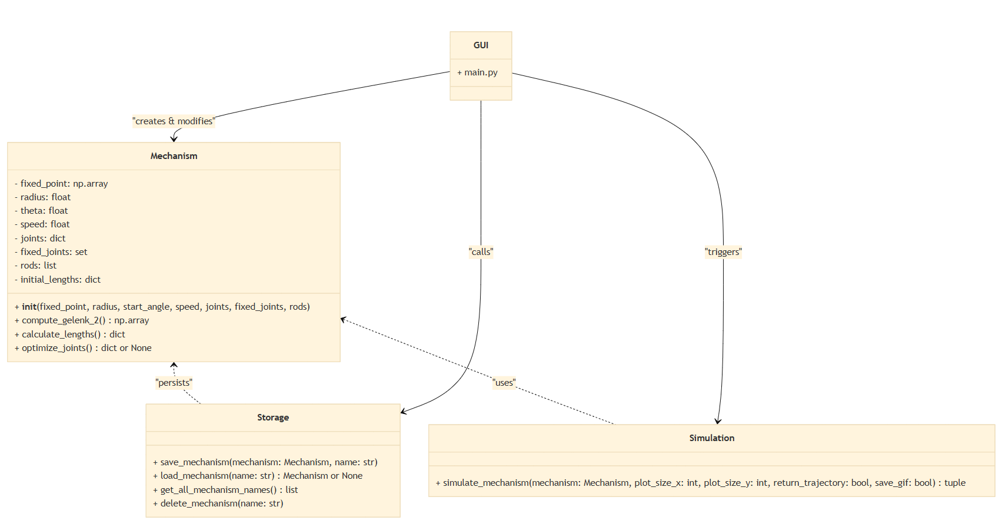
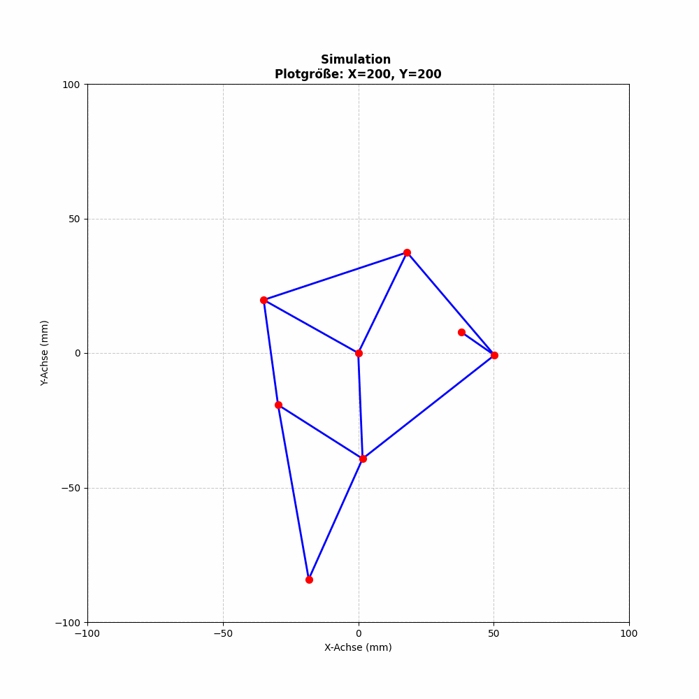
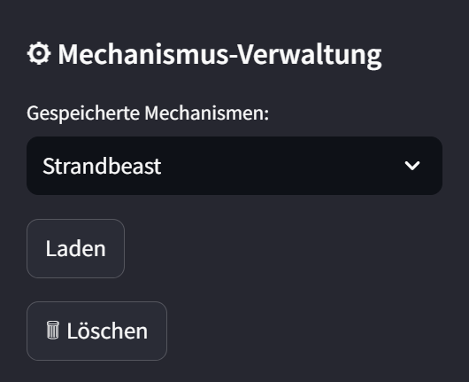
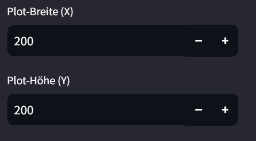
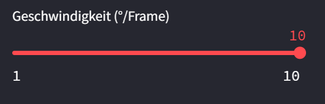

# Softwaredesign_Abschlussprojekt

## 1. Einleitung
Das Ziel dieses Projekts ist die Simulation eines Mechanismus mit beweglichen Gelenken und Stäben. Die Simulation ermöglicht:

- Berechnung der Gelenkpositionen
- Längenoptimierungen
- Visualisierung der Mechanik in einer grafischen Oberfläche (GUI)

Zusätzlich besteht die Möglichkeit, Mechanismen zu speichern und später erneut zu laden.

## 2. Projektstruktur
Das Projekt besteht aus vier Hauptmodulen, die jeweils eine bestimmte Funktionalität abdecken:

### - *Mechanism*
  - Implementierung des Mechanismus mit Gelenken, Stäben und Bewegungssimulationen.

### - *Simulation*
  - Berechnung der Bewegung des Mechanismus.
  - Optionale Speicherung der Simulation als GIF.

### - *Storage*
  - Speichern und Laden von Mechanismen aus einer Datenbank oder einem Dateisystem.

### - *GUI*
  - Eine grafische Benutzeroberfläche zur Interaktion mit der Simulation.

## 3. Klassendiagramm
Hier ist das UML-Diagramm, das die Architektur und die Beziehungen zwischen den Klassen visualisiert:

## 4. Funktionsweise - Mindestanforderungen erfüllt
Das Programm funktioniert folgendermaßen:

1. *Neuen Mechanismus erstellen*: Der Nutzer erstellt einen neuen Mechanismus in der GUI.
2. *Berechnung der Gelenkpositionen*: Die Mechanism-Klasse berechnet die Positionen der Gelenke und die optimalen Stablängen.
3. *Simulation der Bewegung*: Die Simulation-Klasse simuliert die Bewegung des Mechanismus und kann diese als GIF speichern.
4. *Speichern und Laden*: Der Mechanismus kann durch die Storage-Klasse gespeichert oder geladen werden.

## 5. Erweiterungen
 - *GIF erstellen*: Die 'Simulation'-Klasse erstellt und speichert ein GIF.

# Bedienung und Funktionsweise der Mechanismus-Simulation
## 1. Mechanismus-Verwaltung
Ganz oben in der Seitenleiste gibt es die Sektion "Mechanismus-Verwaltung", in der gespeicherte Mechanismen geladen oder gelöscht werden können.

- Laden eines Mechanismus:
Über das Dropdown-Menü können bereits gespeicherte Mechanismen ausgewählt werden. Anschließend kann man den Mechanismus über den Button "Laden" einfügen. Die gespeicherten Werte für Gelenke, Stäbe und andere Parameter werden dann automatisch in die Eingabefelder übernommen.

- Löschen eines Mechanismus:
Wählt man einen gespeicherten Mechanismus aus und klickt auf "🗑 Löschen", wird dieser aus der Speicherliste entfernt.

## 2. Voreinstellungen (Plotgröße & Geschwindigkeit)
Bevor der Mechanismus definiert wird, gibt es einige grundlegende Voreinstellungen:

- Plot-Größe:
Hier kann die Breite (X) und Höhe (Y) des Plots eingestellt werden, um die Mechanismus-Darstellung anzupassen.

- Simulationsgeschwindigkeit:
Über einen Schieberegler kann die Drehgeschwindigkeit von Gelenk 2 in Grad pro Frame festgelegt werden.

## 3. Mechanismus-Erstellung
Mittelpunkt & Startwinkel

- Gelenk 1 (Mittelpunkt) definieren:
Dieses Gelenk bleibt fix und stellt den Rotationsmittelpunkt dar.
X- und Y-Koordinaten werden über Eingabefelder gesetzt.

- Gelenk 2 (auf Kreisbahn rotierend) bestimmen:
Dieses Gelenk bewegt sich um Gelenk 1 auf einem Rotationsradius, der eingestellt werden kann.
Der Startwinkel gibt die Ausgangsposition auf der Kreisbahn an.
Gelenk 2 wird automatisch berechnet und im Plot visualisiert.

## 4. Mechanismus-Visualisierung & Anpassung
Der Plot der Ausgangsstellung zeigt die aktuelle Mechanismus-Konfiguration. Er dient dazu, den Mechanismus visuell zu gestalten und alle Gelenke sowie Stäbe richtig zu positionieren.

Fixierte Gelenke werden schwarz dargestellt.
Nicht fixierte Gelenke sind rot.
Die Gelenknummern sind zur besseren Orientierung beschriftet.

## 5. Gelenke & Stäbe definieren

Gelenke hinzufügen

Die Anzahl der Gelenke kann gewählt werden.
Jedes neue Gelenk bekommt eine eigene X- und Y-Koordinate.

Es gibt zwei wichtige Einstellungen pro Gelenk:

- Fixieren: 
Wenn aktiviert, bleibt das Gelenk starr (schwarz im Plot).

- Bahnkurve anzeigen:
Falls aktiviert, wird die Bewegungsbahn später in der Simulation dargestellt und in der CSV-Datei gespeichert.

Stäbe definieren

Die Anzahl der Stäbe wird festgelegt.
Jeder Stab verbindet zwei Gelenke miteinander und wird durch deren Nummern ausgewählt.
## 6. Mechanismus speichern & Simulation starten
Sobald alle Gelenke und Stäbe definiert wurden, kann der Mechanismus unter einem Namen gespeichert werden.

- Simulation starten:
Die Bewegung wird für eine komplette Umdrehung von 0° bis 360° simuliert.
Falls der Mechanismus fehlerhaft ist (z. B. inkorrekte Längen), wird eine Warnung ausgegeben.

## 7. Simulationsergebnisse & Export
Nach Abschluss der Simulation:

- GIF-Animation:
Die Simulation wird flüssig als GIF eingeblendet.
Es kann heruntergeladen werden.

- CSV-Datei mit Bahnkurven:
Enthält nur die Gelenke, bei denen die Option "Bahnkurve anzeigen" aktiviert war.
Kann ebenfalls heruntergeladen werden.
Hinweis:
Wird der Mechanismus verändert, muss die Simulation neu geladen werden, um die aktualisierten Parameter zu berücksichtigen.